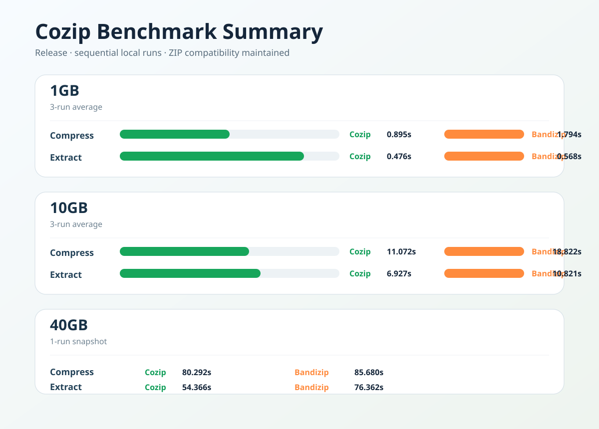

# Cozip

Cozip는 표준 ZIP 호환성을 유지하면서 압축과 해제 성능을 끌어올리는 데 집중한 `C++20` 기반 ZIP 엔진입니다.

프로젝트의 기준은 명확합니다.

- ZIP-only
- 표준 ZIP 호환 유지
- 고속 압축과 고속 해제
- native, GUI, WASM 같은 상위 환경에서 재사용 가능한 엔진 구조

독자 포맷은 다루지 않습니다. Cozip가 만든 ZIP은 외부 ZIP 도구와 호환되어야 하고, 외부 도구가 만든 ZIP도 Cozip에서 다룰 수 있어야 합니다.

## Features

- ZIP 생성, 추출, 목록 조회, 무결성 테스트
- `Store`, `Fast`, `Balanced`, `Small`, `Maximum` 압축 프로필
- `Traditional PKWARE` ZIP 암호 지원
- 파일 매핑 on/off 제어
- request/context 기반 실행 API
- CLI 및 GUI 프런트엔드

## Status

현재 구현 방향은 ZIP 전용 엔진입니다.

- 지원 포맷: `ZIP`
- 지원 암호: `Traditional PKWARE`
- 미지원 암호: `WinZip AES`
- 핵심 명령: `create`, `extract`, `list`, `test`

## Performance Snapshot



로컬 Release 기준 순차 측정 요약입니다. 환경과 데이터셋에 따라 결과는 달라질 수 있습니다.

## Requirements

- `CMake 3.24+`
- `C++20` 지원 컴파일러
- Windows 환경 권장

서드파티 의존성은 submodule로 관리합니다.

```powershell
git clone --recurse-submodules <repo-url>
```

이미 clone한 경우:

```powershell
git submodule update --init --recursive
```

## Build

```powershell
cmake -S . -B build
cmake --build build --config Release
```

테스트 포함 빌드:

```powershell
cmake -S . -B build -DCOZIP_BUILD_TESTS=ON
cmake --build build --config Release
```

## CLI

```text
cozip_cli version
cozip_cli help
cozip_cli create [--store|--deflate|--fast|--balanced|--small|--max] [--threads N] [--memory-mb N] [--chunk-kb N] [--password VALUE] <output.zip> <input...>
cozip_cli extract [--password VALUE] <archive.zip> [output-dir]
cozip_cli list <archive.zip>
cozip_cli test [--password VALUE] <archive.zip>
```

예시:

```powershell
.\build\apps\cli\cozip_cli.exe create --fast output.zip .\input-folder
.\build\apps\cli\cozip_cli.exe extract archive.zip .\output-folder
.\build\apps\cli\cozip_cli.exe list archive.zip
.\build\apps\cli\cozip_cli.exe test archive.zip
.\build\apps\cli\cozip_cli.exe create --password secret123 secure.zip .\input-folder
```

## Library Usage

기본 사용 방식은 `ArchiveJob`을 구성한 뒤 `cozip::format_zip::Execute()`를 호출하는 것입니다.

```cpp
#include "cozip/core/archive_job.h"
#include "cozip/format_zip/zip_archive.h"

cozip::core::ArchiveJob job {};
job.type = cozip::core::JobType::CreateArchive;
job.format = cozip::core::ArchiveFormat::Zip;
job.profile = cozip::core::CompressionProfile::Fast;
job.output_path = "out.zip";
job.inputs.push_back({"input-folder", true});

job.execution.worker_count = 8;
job.execution.memory_budget_mb = 2048;
job.execution.mapping_mode = cozip::core::MappingMode::Auto;

const auto result = cozip::format_zip::Execute(job);
```

암호 ZIP 생성:

```cpp
job.execution.encryption.mode = cozip::core::EncryptionMode::ZipTraditional;
job.execution.encryption.password = "secret123";
```

암호 ZIP 추출:

```cpp
job.type = cozip::core::JobType::ExtractArchive;
job.inputs = {{"archive.zip", false}};
job.output_path = "out-dir";
job.execution.encryption.mode = cozip::core::EncryptionMode::ZipTraditional;
job.execution.encryption.password = "secret123";
```

## Project Layout

```text
Cozip/
├─ apps/
│  ├─ cli/
│  └─ gui/
├─ engine/
│  ├─ codecs/
│  ├─ core/
│  ├─ format_zip/
│  ├─ pipeline/
│  ├─ platform/
│  └─ storage/
├─ tests/
└─ third_party/
```

- `apps`: CLI와 GUI 프런트엔드
- `engine/core`: 요청 모델, 실행 옵션, 실행 컨텍스트
- `engine/storage`: random access reader/writer 인터페이스
- `engine/platform`: 파일 시스템 구현과 mapped file
- `engine/pipeline`: 실행 계획과 파이프라인 옵션
- `engine/codecs`: 압축 코덱 레이어
- `engine/format_zip`: ZIP 포맷 구현
- `tests`: 단위 테스트와 호환성 테스트

## Testing

```powershell
ctest --test-dir build --output-on-failure
```

주요 테스트 타깃:

- `cozip_unit_tests`
- `cozip_zip_compat_tests`
- `cozip_zip_external_compat_tests`

## Notes

- 프로젝트는 ZIP-only 방향으로 정리되어 있습니다.
- 모든 최적화는 ZIP 표준 범위 안에서 진행합니다.
- 목표는 ZIP 호환성, 성능, 재사용성, 확장성을 함께 높이는 것입니다.
